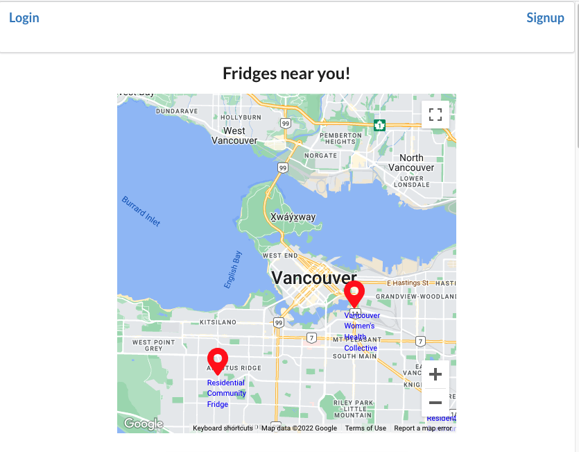
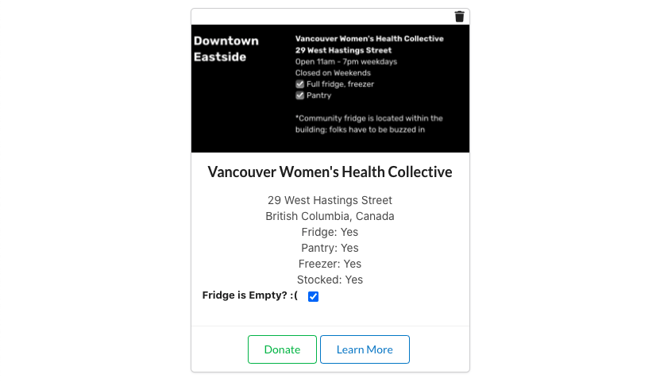

## Capstone Project - Community Fridges
My community fridges app is for community fridge organizers and volunteers to communicate when a fridge is stocked, if it needs cleaning, etc. The app also allows unauthenticated visitors to see fridges near their current location. 

### Getting Started
[Community Fridges App](https://cfridges.herokuapp.com/)  
[Trello Board](https://trello.com/b/mSn1d07V/pw-community-fridges-app)

### Technologies Used
- Express
- JavaScript
- MongoDB/Mongoose
- Node.js
- React
- Semantic-UI-React

Third-Party APIs:  
Google Maps JavaScript API, Google Geocoding API, Geolocation API  

### Screenshots
Visitor landing page  

Logged In User homepage  

Add a Fridge Form  

Logged In User's Fridge Card  

### Next Steps
- Add a wishlist for fridges - maintained by fridge owner
- Automatically toggle the Stocked status to false after a set time
- Provide a user profile page - if useful
- Provide a show details fridge page - if useful
- ~~AAU, I can add comments to a fridge~~ copmleted on 5/30/2022
- ~~Filter fridges by state / province~~ completed on 5/31/2022